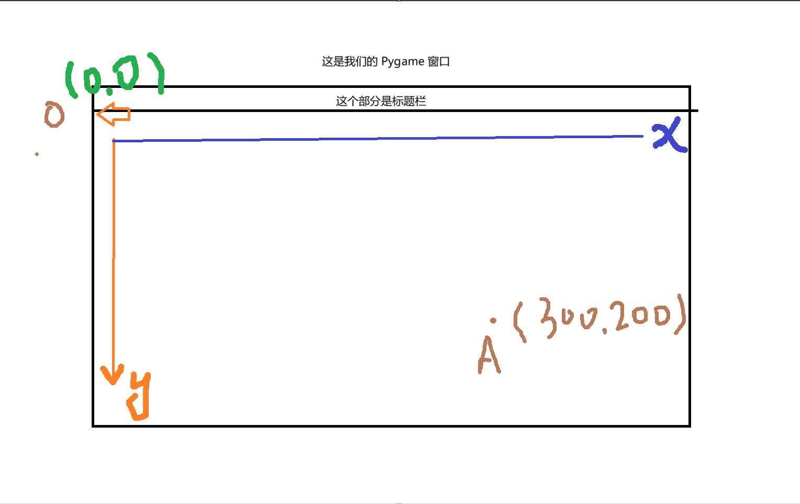

# Python 跳一跳 游戏开发系列
## Lesson 01 -  Python 基础知识预备

**1. Pygame 简介**

我们游戏开发使用的核心库为 `Pygame`, 我拷贝了它的简介
> Pygame is a free and open-source cross-platform library for the development of multimedia applications like video games using Python. It uses the Simple DirectMedia Layer library and several other popular libraries to abstract the most common functions, making writing these programs a more intuitive task.

为了具备使用这个库完成我们小游戏项目的基本能力，我尽可能用简单的流程带大家熟悉 Python 的一些基础语法

我将**不使用各种设计模式，面向对象，高级算法**，仅从最简单的逻辑带大家实现基本功能


**2. Python 语法基础**    

我为了控制项目整体的难度，将所有会用到的语法局限在了下面几种，各位若是没有太多编程基础也无需担心

- 变量定义
    ```a = 3; b = 2```
- 函数调用
    ```python 
        # 调用语法：函数的完整称呼(若干参数)
        print('Hello, world!')
        -----   -----------
        函数名      参数

        # 完整称呼可能很长，例如 pygame 中的一些东西
        pygame.image.load('好康的.jpg')
        ----------------- ----------
            完整称呼          参数

        # 类比数学上函数即可，在数学函数的概念可以是编程领域函数的概念的子集
        x = 3
        f(x) # 调用名字为 f 的函数，x 变量保存的值作为参数
    
        # 数学上我们不太容易见到多元函数（多个参数）
        # 编程中很常见
        # 秉持一句话，他要什么我们给他就完事了
    ```

    > 我们不需要关注函数是怎么实现的（有能力可以自行探究，找我交流），只需要知道他能做什么，怎么用即可

- 循环与条件
    
    类比 Scratch 里面的东西理解
    ```python
        # 循环 n 次的固定语法
        # 重复执行 ... 次
        for _ in range(n): ...

        # 遍历一个列表
        # 对于 ... 中的每一个元素, ...
        for sth in lst: ...

        # 无限循环
        while True: ...

        # 简单条件
        # 如果...那么...
        if 条件: ...

        # 分支条件
        # 如果...那么...否则...
        if 条件: ...
        else: ...

        # 多条件
        # 如果...那么...或是...那么...
        if 条件: ...
        elif 另一个条件: ...
    ```

- 模块与导入

    - 我们会用到的模块：
        
        1. math 数学内置库（应该比较好理解）
        2. pygame 核心库

    ```python
        # 使用时按如下方法导入，固定写在文件开头即可
        import math

        from pygame import *
    ```

- 列表操作
    ```python
        lst = []
        # 添加元素
        lst.append(1)
        # 现在 lst 是 [1]
        lst.append(2)
        # 现在 lst 是 [1, 2]

        # 求得列表中元素个数
        len(lst)
        # 现在是 2 个元素

        # 遍历列表
        for i in lst:
            print(i)

        # 将会输出列表里每一个元素
        1
        2
    ```

- 函数定义 (我会尽可能避免定义过多自己的函数，但有时实在避免不了) 
    ```python
        def my_function():
            print(114514)
            print(1919810)

        my_function()
        # 等效于执行了函数内部的两行代码
        # 定义时用了什么名字，使用时就保持一致

        # 我们的函数同样可以有参数
        def distance_between_point(x1, y1, x2, y2):
            # 你希望的参数名字写在括号内
            # 在函数里面直接当已经定义好的变量用就完事了
            # 真正使用时将会被替换成你给的值
            # 结合数学函数理解
            # f(x) = x * 2 + 3
            # f(3) = 3 * 2 + 3 = 9
            return ((x2 - x1) ** 2 + (y2 - y1) ** 2) ** 0.5

        # 求两点距离，基本就是数学计算
        distance = distance_between_point(1, 1, 2, 2)
        # 求算 (1, 1) 到 (2, 2) 之间的距离
        # 函数结尾有个 return,这让整个函数可以被放在等号右侧，等号左边的变量就是return 后那个式子的结果
        # 亦或是作为其他函数的参数（类比数学：复合函数）
        # g(f(x))
    ```

- python 语法就这么多，虽然有很多高级语法能让代码更优雅，简洁，但是没必要，徒增学习成本（你要是想知道我可以顺带提一下）

- 我本人也是学习过 cpython 源代码，手搓过简易的类 python 语言，对于语言特性还是比较了解的，有疑问欢迎找我交流


**3. 一点点数学基础? (非必须但是可能有助于理解)**
    
- 这部分主要是坐标系与平面向量的东西，你们到高一下学期数学课也会学习

- 首先建立坐标系的概念
- 计算机图形窗口当中的坐标系与我们做数学题那种坐标系不太一样
- 为了简便，取窗口左上角为原点 (0, 0)
- 保证了窗口内任意一点坐标分量均为非负数
- 示意图：
    

- 两点间距离
- 平面向量我暂时不提了，以后若要用再说（我尽量避免）

- 有一个重要的东西：`牛顿第二定律：F = ma，即物体所受合外力 = 物体质量 * 物体的合加速度`，你们物理可能还没学，但是这个是实现我们跳一跳游戏**跳跃和重力**的关键

- 还要知道速度，加速度均为矢量（向量）即可（这部分主要是实现移动逻辑时用到的）

- RGBA 色彩空间


**4. Python + Pygame 安装 & vscode 环境配置**

- 实机演示


**5. 示例代码编写：在屏幕上渲染一张图片**
- 代码详见: `test01.py`
